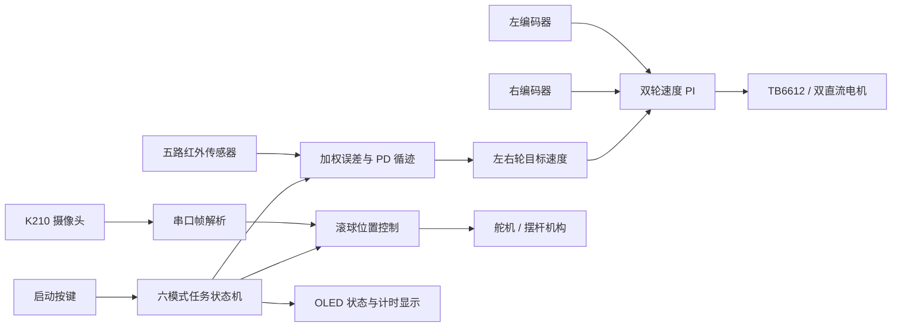

# 车载平衡滚球运动控制系统

[](https://www.ti.com/product/MSPM0G3507)
[](https://en.wikipedia.org/wiki/C_(programming_language))
[](https://www.keil.com/)
[](#构建与验证)

基于 TI MSPM0G3507 的双轮差速智能车控制系统，面向 2026 年河南赛区 H 题“车载平衡滚球运动控制系统”。项目集成五路红外循迹、编码器测速、双轮速度控制、A 点横线识别、K210 视觉测量、滚球位置控制、OLED 人机交互和多任务模式管理。

> 当前状态：固件已通过 Keil ARM Compiler 6 完整编译；五路传感器读取、控制方向和安全状态机已完成静态验证。车辆直线速度一致性和赛道参数仍需结合实车标定，因此本仓库不宣称已达到赛题时间与精度指标。

## 项目亮点

- 将开源八路循迹方案的“位置加权 + PD 差速 + 弯道降速”思想重新建模为五路数字传感器实现，没有直接移植 STM32F1 底层代码。
- 使用 `-4、-2、0、2、4` 非线性位置权重计算黑线偏差，OUT3 对应直行，OUT2/OUT4 提前纠偏，OUT1/OUT5 处理大偏差。
- 设计等待启动、正常循迹、丢线搜索、超时停车四态安全状态机，丢线后先减速，再按最后可靠方向低速搜线。
- 将循迹方向环和左右轮速度环分层，保留双编码器独立 PI、积分限幅、输出限幅和斜率限制能力。
- 使用 SysConfig 统一管理引脚和外设，自动生成 `ti_msp_dl_config.c/.h`，减少手工配置冲突。
- 采用模块化 C 架构，将应用状态机、控制算法、板级驱动和设备驱动解耦，便于独立调试与参数标定。
- 通过 K210 获取钢球位置，并使用串口协议传递位置数据，为滚球闭环控制提供测量输入。

## 系统架构



## 核心控制方案

### 五路循迹

五个红外通道从左到右对应 OUT1～OUT5，检测黑线时输出低电平：

```text
OUT1 = PB5   -> bit0 = 0x01
OUT2 = PB15  -> bit1 = 0x02
OUT3 = PA10  -> bit2 = 0x04
OUT4 = PB16  -> bit3 = 0x08
OUT5 = PA11  -> bit4 = 0x10
```

检测到多个传感器时，使用有效通道的位置加权平均值作为横向误差：

```text
error = sum(active[i] * position[i]) / sum(active[i])
position = {-4, -2, 0, 2, 4}
```

方向控制采用带低通滤波的 PD：

```text
steering = Kp * error + Kd * filtered(error - previousError)
```

转向时保持外侧轮目标速度，仅降低内侧轮目标速度；进入预弯和边缘状态时同步降低基础速度，避免高速冲出赛道。

### 丢线保护

连续多次未检测到黑线后进入丢线搜索：

1. 立即按受限斜率降低车速。
2. 根据最后可靠误差确定搜索方向。
3. 使用低速内外轮差速寻找黑线。
4. 在限定时间内未找回黑线则停止电机。
5. 找回黑线后限制恢复速度，避免目标突变。

### 速度与滚球控制

- 左右轮分别保留编码器速度 PI，可独立设置参考计数和输出限制。
- 当前速度 PI 默认关闭，待实际车辆完成左右编码器标定后启用。
- K210 负责检测钢球位置，MSPM0 负责协议解析、目标管理和舵机控制。
- 模式三提供无需视觉输入的开环滚球轨迹，用于机构联调和应急测试。

## 软件结构

```text
App/
  app_controller.c     六种任务模式与启动/停止状态机
  app_config.h         循迹、速度、滚球和安全参数
  line_follow.c        五路采样、误差计算、PD、丢线保护
  wheel_speed_pi.c     左右轮独立速度 PI
  ball_control.c       钢球位置控制
  vision_protocol.c    K210 串口协议解析
  user_interface.c     按键、OLED 和计时交互

BSP/
  bsp_motor.c          TB6612 电机方向与 PWM
  bsp_encoder.c        左右编码器计数
  bsp_servo.c          舵机脉宽控制
  bsp_buzzer.c         蜂鸣器提示

Drivers/
  communication/       串口通信
  mpu6050/             IMU 驱动
  oled/                OLED 显示驱动

K210/
  ball_tracking.py     钢球视觉检测脚本

empty.syscfg           SysConfig 外设配置源文件
keil/                  Keil MDK 工程
```

## 任务模式

1. 低速循迹调试。
2. 快速循迹一圈并在 A 点横线停车。
3. 静态滚球开环轨迹测试。
4. A-B 段循迹并保持钢球中心位置。
5. 循迹一圈并保持钢球中心位置。
6. 循迹一圈并保持钢球指定位置。

## 构建与验证

开发环境：

- MCU：TI MSPM0G3507，Arm Cortex-M0+
- SDK：MSPM0 SDK 2.11.00.07
- 配置工具：TI SysConfig 1.28.0
- IDE：Keil MDK
- 编译器：Arm Compiler 6.23

构建步骤：

1. 安装 MSPM0 SDK、SysConfig 和 Keil 的 MSPM0 Device Pack。
2. 使用 Keil 打开 `keil/empty_LP_MSPM0G3507_nortos_keil.uvprojx`。
3. 根据本机 SDK 安装位置检查工程 Include Path 和 Before Build 命令。
4. 执行 Rebuild；SysConfig 会先根据 `empty.syscfg` 重新生成外设配置。

最近一次完整构建结果：

```text
Program Size: Code=19180 RO-data=516 RW-data=0 ZI-data=2208
0 Error(s), 0 Warning(s)
```

验证边界：

- 已验证：SysConfig 生成、全工程编译、五路引脚映射、位图逻辑和转向目标方向。
- 待验证：左右轮实际速度标定、完整环形赛道循迹、A 点停车误差、滚球动态误差和整圈时间。

## 调试方法

模式一使用低速参数。OUT3 正对黑线时，建议在 Keil Watch 中检查：

```text
g_linePatternDebug              应为 0x04
g_lineErrorX1000Debug           应接近 0
g_wheelSpeedLeftTargetX10       应与右轮目标一致
g_wheelSpeedRightTargetX10
g_wheelSpeedLeftDelta           左轮编码器增量
g_wheelSpeedRightDelta          右轮编码器增量
g_wheelSpeedLeftOutputX10       左轮实际 PWM 输出
g_wheelSpeedRightOutputX10      右轮实际 PWM 输出
```

OLED 的 `B` 表示滤波后的黑线位图，`R` 表示五路原始高电平位图。

## 简历描述参考

> 基于 MSPM0G3507 设计车载平衡滚球智能车固件，采用模块化 C 架构实现五路红外加权 PD 循迹、双编码器速度控制、丢线降速搜索与超时停车安全状态机；通过 SysConfig 管理 GPIO、PWM、QEI、UART 等外设，并集成 K210 视觉测量、舵机滚球控制和 OLED 多模式交互。完成 Keil ARM Compiler 6 全工程构建验证，实现 0 Error、0 Warning，并建立传感器位图、目标速度、编码器增量和 PWM 输出的分层调试链路。

## 后续计划

- 完成左右编码器 20 ms 参考计数标定并重新启用速度 PI。
- 记录直线、半径 0.5 m 弯道和丢线恢复的实车数据。
- 增加循迹与滚球位置数据记录，形成可复现的参数整定报告。
- 补充整车照片、赛道视频和控制效果曲线。

## 说明

本项目仍处于实车联调阶段。仓库中的控制参数与特定底盘、电机、编码器、传感器高度和供电条件相关，移植到其他车辆前必须重新标定。
